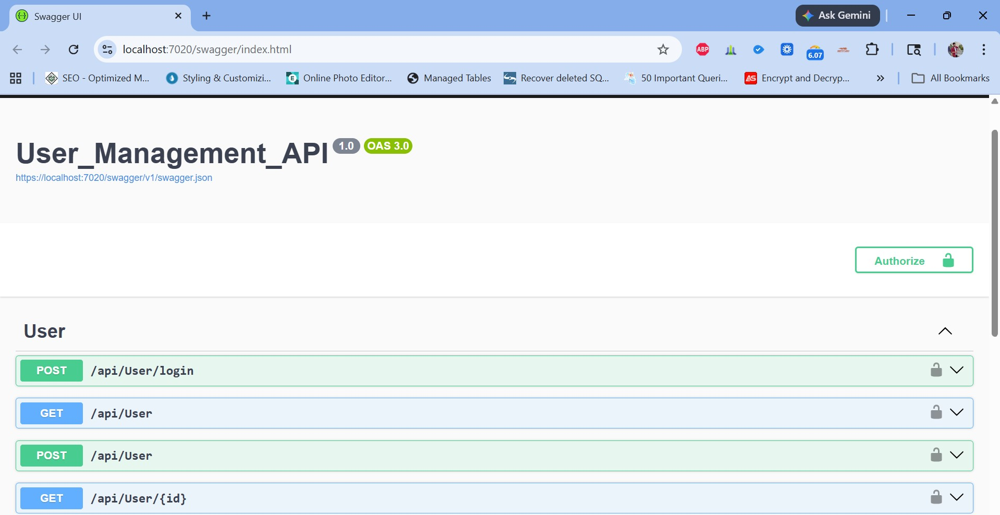
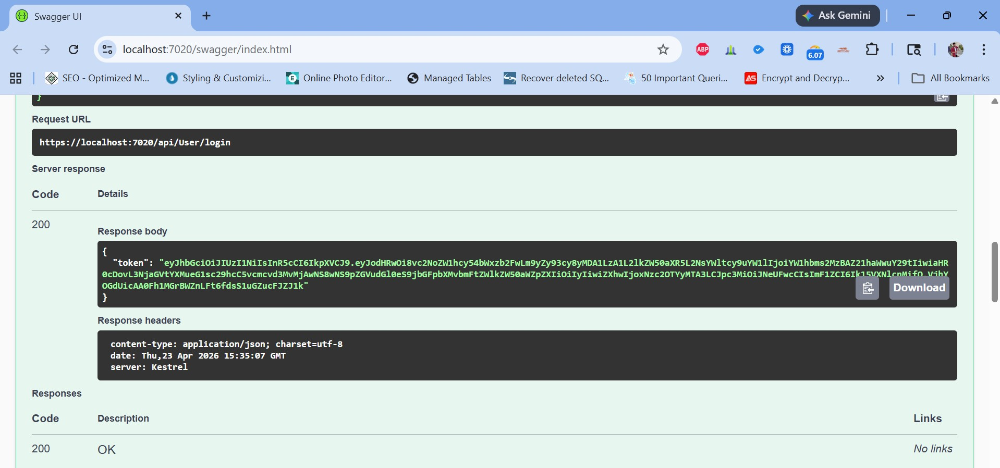
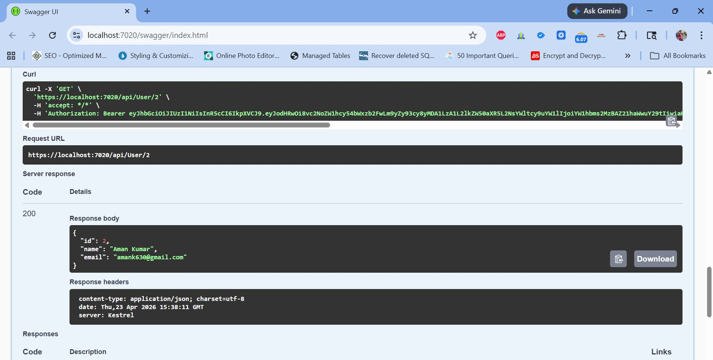

# User Management API (.NET)

## Features
- User Registration & Login
- JWT Authentication
- Secure APIs with Authorization
- SQL Server with Entity Framework Core
- Repository Pattern + Service Layer
- DTO-based Architecture

## Tech Stack
- ASP.NET Core Web API
- Entity Framework Core
- SQL Server
- JWT Authentication

## How to Run
1. Clone repository
2. Update connection string
3. Run migrations
4. Run project

## API Endpoints
- POST /api/user/register

## Architecture
Controller → Service → Repository → Database

## Security
- JWT Authentication
- Password Hashing (BCrypt)

## Future Improvements
- Role-based authorization
- Refresh tokens
- Docker deployment
- POST /api/user/login
- GET /api/user (Protected)

## Screenshots

### Swagger UI

### Login Response (JWT Token)

### Add_User

### Users_List

### Get_User_By_ID

